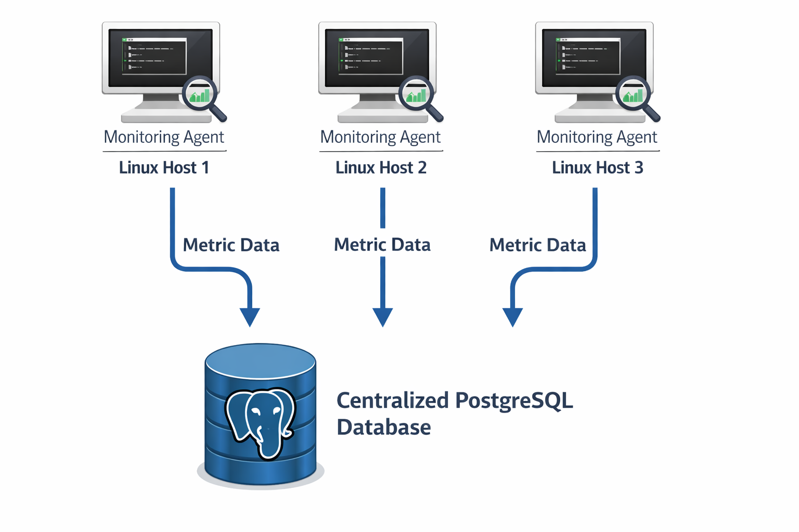

# Linux Cluster Monitoring Agent
## Introduction

This project implements a Linux-based monitoring system designed to collect hardware specifications and real-time system usage metrics from multiple Linux hosts and store them in a centralized PostgreSQL database. The goal of the project is to simulate a real-world Linux cluster administration environment, where system administrators need continuous visibility into server performance and capacity usage.

Each Linux host runs lightweight Bash scripts that collect CPU, memory, and disk metrics using native Linux utilities. The collected data is inserted into a PostgreSQL database running inside a Docker container, ensuring portability and consistency across environments. Cron jobs are used to automate data collection at regular intervals without manual intervention.

The project makes use of Bash scripting for automation, PostgreSQL for relational data storage, Docker for containerized database deployment, Git for version control, Linux as the operating platform, and cron for scheduling recurring tasks.

## Quick Start

Start a PostgreSQL instance using Docker:

    cd linux_sql
    ./scripts/psql_docker.sh create postgres mypassword

Create database tables using the DDL script:

    psql -h localhost -p 5432 -U postgres -d host_agent -f sql/ddl.sql

Insert host hardware specifications into the database:

    ./scripts/host_info.sh localhost 5432 host_agent postgres mypassword

Insert host usage metrics into the database:

    ./scripts/host_usage.sh localhost 5432 host_agent postgres mypassword

Set up a cron job to automate usage data collection every minute:

    crontab -e
    * * * * * bash /home/rocky/dev/jarvis_data_eng_PuneetSingh/linux_sql/scripts/host_usage.sh localhost 5432 host_agent postgres mypassword >> /tmp/host_usage.log 2>&1

## Implementation

The monitoring system consists of two primary Bash scripts. The host_info.sh script collects static hardware information such as CPU count, CPU architecture, cache size, and total memory. This data is inserted once per host into the database to avoid duplication.

The host_usage.sh script collects dynamic runtime metrics including CPU idle percentage, memory availability, disk I/O, and available disk space. These metrics are collected periodically and stored as time-series data.

The PostgreSQL database is deployed inside a Docker container and managed using the psql_docker.sh script, which handles container creation, startup, and shutdown. Database schemas are defined using SQL DDL scripts. Cron is used to automate the periodic execution of the usage collection script.

## Architecture

The system follows a centralized monitoring architecture. Multiple Linux hosts act as monitoring agents, each collecting local system metrics. All collected data is sent to a centralized PostgreSQL database running in a Docker container. This design allows administrators to query and analyze metrics across multiple hosts from a single data source.

An architectural diagram illustrating three Linux hosts, monitoring agents, and a centralized PostgreSQL database is stored in the assets directory.

## Scripts

The psql_docker.sh script manages the lifecycle of the PostgreSQL Docker container, including creating, starting, and stopping the container.

The host_info.sh script collects static hardware specifications from the Linux host and inserts the data into the host_info table. Each host is uniquely identified by its hostname.

The host_usage.sh script collects runtime system usage metrics and inserts them into the host_usage table at regular intervals.

Cron is used to schedule the execution of the host_usage.sh script to ensure continuous and automated data collection.

The queries.sql file contains SQL queries designed to analyze collected metrics, such as identifying hosts with high CPU usage or low available disk space.

## Database Modeling

### host_info

The host_info table stores static hardware information for each Linux host.

| Column Name       | Data Type  | Description                                  |
|-------------------|------------|----------------------------------------------|
| id                | SERIAL     | Unique identifier for each host              |
| hostname          | VARCHAR    | Fully qualified hostname                     |
| cpu_number        | SMALLINT   | Number of CPU cores                          |
| cpu_architecture  | VARCHAR    | CPU architecture type                        |
| cpu_model         | VARCHAR    | CPU model name                               |
| cpu_mhz           | FLOAT      | CPU clock speed in MHz                      |
| l2_cache          | INTEGER    | L2 cache size in KB                          |
| total_mem         | INTEGER    | Total memory in MB                           |
| timestamp         | TIMESTAMP  | Time when the record was inserted            |

### host_usage

The host_usage table stores dynamic system usage metrics collected periodically.

| Column Name       | Data Type  | Description                                  |
|-------------------|------------|----------------------------------------------|
| timestamp         | TIMESTAMP  | Time when metrics were collected             |
| host_id           | INTEGER    | Foreign key referencing host_info(id)        |
| memory_free       | INTEGER    | Free memory in MB                            |
| cpu_idle          | SMALLINT   | CPU idle percentage                          |
| cpu_kernel        | SMALLINT   | CPU kernel usage percentage                  |
| disk_io           | INTEGER    | Disk I/O operations                          |
| disk_available    | INTEGER    | Available disk space in MB                   |

## Test

Testing was performed on a Linux virtual machine with Docker installed. The PostgreSQL container was validated using Docker commands to ensure it was running correctly. The DDL script was executed to confirm successful table creation. Both monitoring scripts were run manually to verify correct data insertion. Cron execution was validated by observing periodic data updates in the database.

## Deployment

The project is deployed using GitHub for version control, Docker for database containerization, and cron for scheduling automated data collection. Once deployed, the monitoring agents run continuously with minimal manual maintenance.

## Improvements

Future improvements include adding support for detecting hardware changes automatically, improving error handling and logging in all Bash scripts, and extending monitoring coverage to include network me
